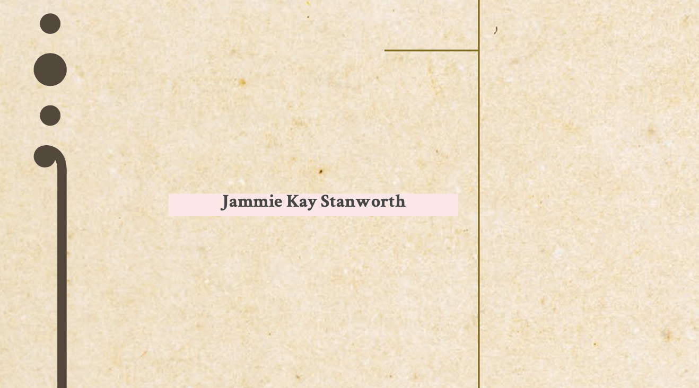
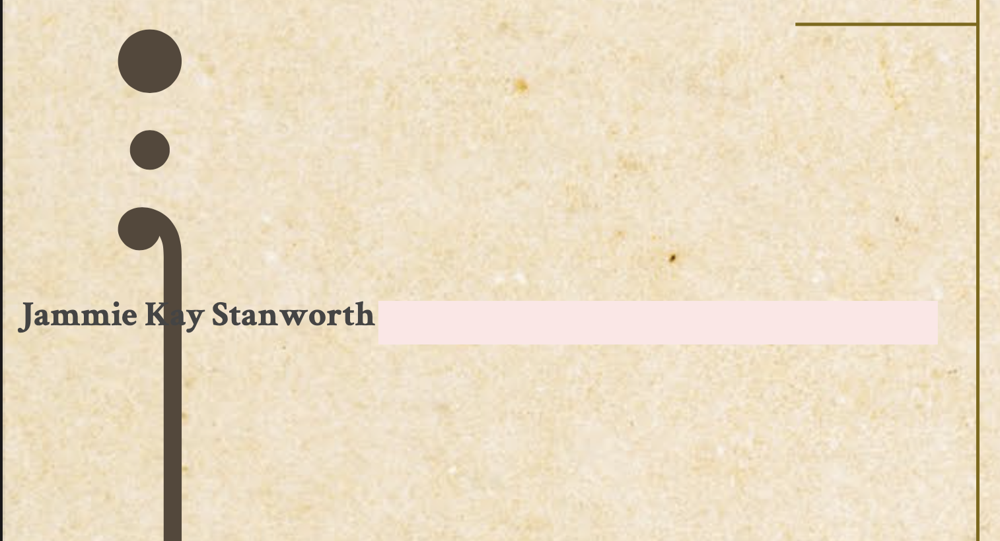

The goal is to render two text placeholders. The example shows how one affects the position of the other. To better represent the destination, they are highlighted in pink.

To run the example:

```
bundle install
bundle exec ruby pdf.rb
```

Example2 shows how this should be rendered. Example1 shows how this is rendered if another is rendered beforehand.


